# Spring Security

Quando adicionamos a dependência do spring security no nosso projeto, ele já bloqueia o acesso de todas as rotas e disponibiliza uma tela de login com usuário padrão "user" e a senha que é um hash disponibilizado no log da aplicação:

```
Using generated security password: c5ca81eb-671e-4ee5-bea6-c0ec048e04fb

This generated password is for development use only. 
Your security configuration must be updated before running your application in production.
```
> Assim que fica a url após autênticar:<br>
> http://localhost:8081/public?continue 

> Também é possível realizar logout através da url: <br>
> http://localhost:8081/logout

## Tela de Login ao tentar acessar a rota /public
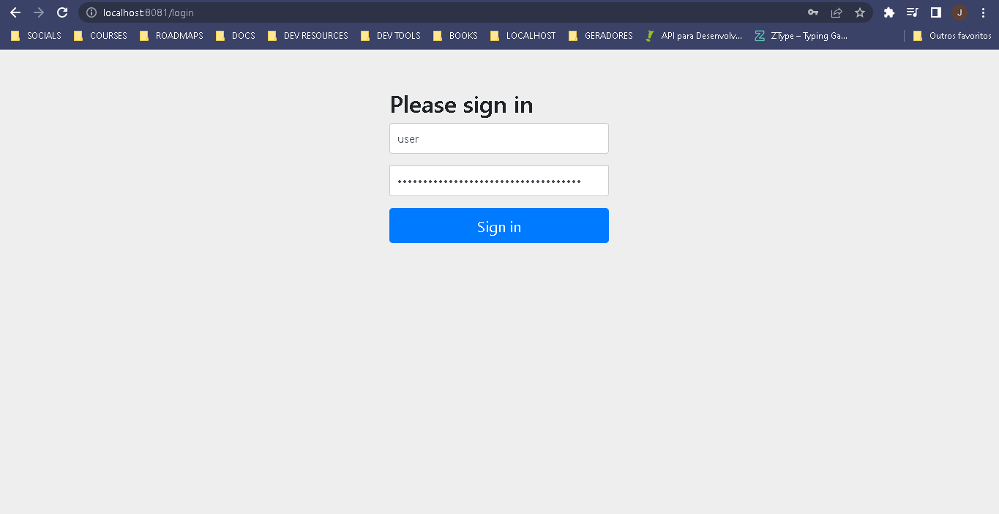

## Tela autênticada ao acessar a rota /public
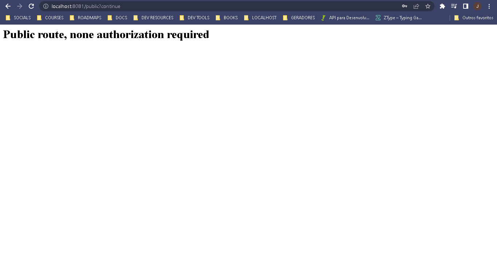

## Tela de confirmação de logout ao acessar a rota /logout e bloqueio de acesso
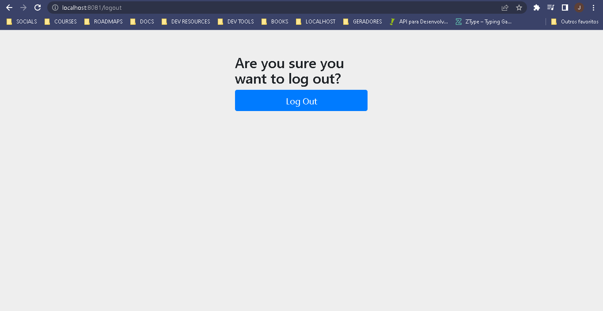
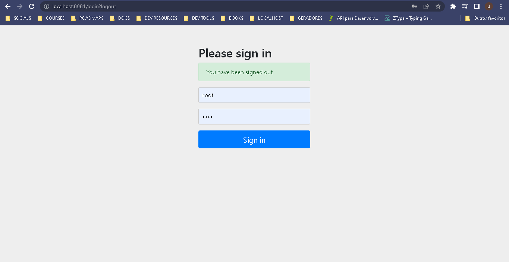

# Autênticando apenas rotas específicas

Como o próprio nome deixa explicito, não queremos barreiras na rota pública. Uma solução simples consiste em criar uma classe SecurityConfig e definir algumas configurações:
```java
@Configuration
@EnableWebSecurity
public class SecurityConfig {
    // a segurança é feita através de filtros
    @Bean
    SecurityFilterChain securityFilterChain(HttpSecurity http) throws Exception{
        return http
                .authorizeHttpRequests(
                        authorizeConfig -> {
                            authorizeConfig.requestMatchers("/public").permitAll(); // permite a rota public
                            authorizeConfig.requestMatchers("/logout").permitAll();
                            authorizeConfig.anyRequest().authenticated(); // exige autênticação em todas as rotas 
                        }
                )
                .formLogin(Customizer.withDefaults())
                .build();
    }
}
```
- O método permitAll() libera acesso a algum caminho através de algum parâmetro, neste caso através do matcher da resquest com o url.
- A configuração anyRequest().authenticated() define que quaisquer outros endereços que não sejam os liberados exigam autêntição
- O método formLogin() recebe como parâmetro o formulário padrão do spring security, caso não use essa configuração as urls que necessitam de autênticação retornam 403.

## Retorno da url /private caso a formLogin não esteja configurada
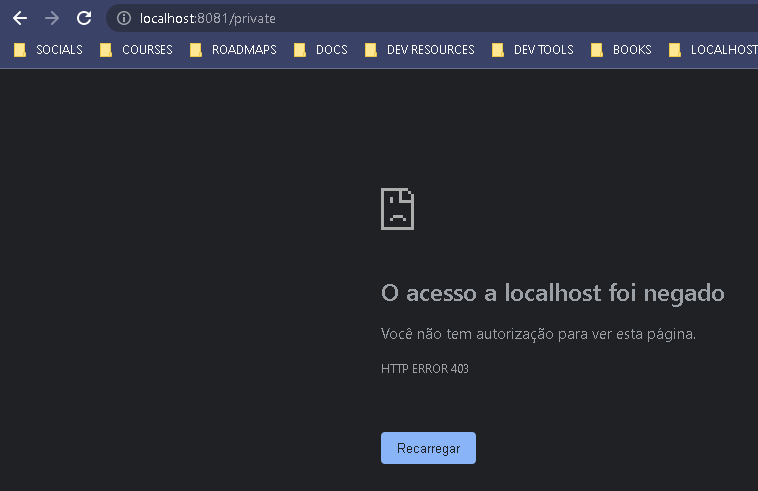

<hr>

## Observação
- Essa não é uma forma comum de autenticar aplicações, normalmente usamos nossos usuários, cadastrados nas nossas bases de dados ou em algum identity provider externo ex(google, facebook, github).
<hr>

- Nos próximos passos modificaremos o projeto para utilizar uma credencial provida pelo Google (OAuth2)

### Criando as credencias com Google
No site: https://console.cloud.google.com/apis/credentials adicionamos uma nova Id do cliente OAuth2.0 como credencial, definindo nomes e adicionando o endereço da aplicação (localhost no nosso caso) junto ao caminho /login/oauth2/code/google
<br>
<br>
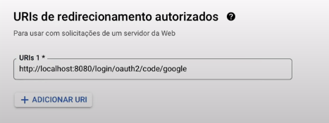
<br>
Logo após isso nós copiamos o <strong>id de cliente</strong> e a <strong>chave secreta</strong> para dentro do application.properties

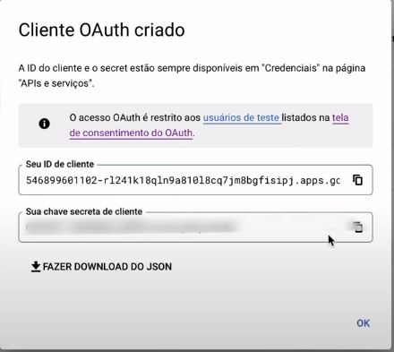

````properties
spring.security.oauth2.client.registration.google.client-id=247983531729-c1ut5f3ake4tejh0uhevs5qkftaglavt.apps.googleusercontent.com
spring.security.oauth2.client.registration.google.client-secret=xxxxxxxxxxxxxxxxxxxxxxxxxxxxxxxxxxxxxxxxxxxxxxxxxxx
````
Agora temos a configuração da nossa aplicação parceira oauth <br>
Basta alterar a configuração de segurança substituindo o FormLogin pleo oauth2Login:
```java
public class SecurityConfig {
    // a segurança é feita através de filtros
    @Bean
    SecurityFilterChain securityFilterChain(HttpSecurity http) throws Exception{
        return http
                .authorizeHttpRequests(
                        authorizeConfig -> {
                            authorizeConfig.requestMatchers("/public").permitAll();
                            authorizeConfig.requestMatchers("/logout").permitAll();
                            authorizeConfig.anyRequest().authenticated();
                        }
                )
                .oauth2Login(Customizer.withDefaults())
                .build();
    }
}
```
### Ao acessar a rota /private teremos o seguinte retorno:
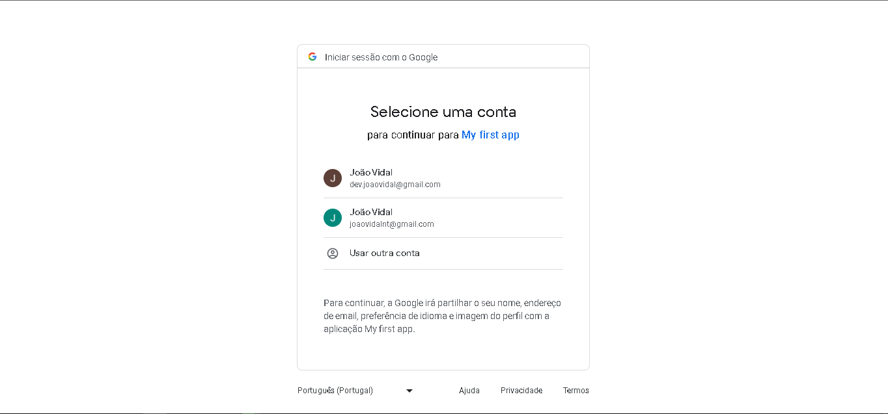

### E ao logarmos com uma conta do google teremos acesso á rota:
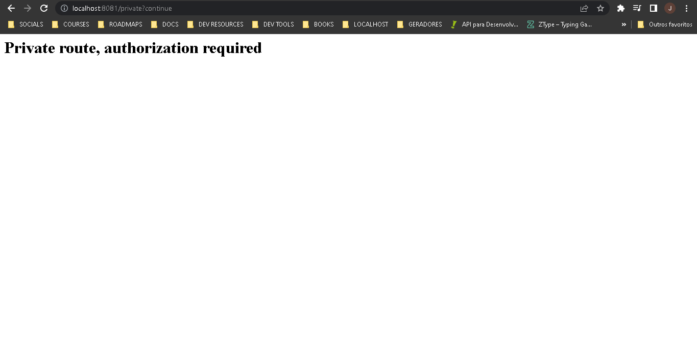

## Utilizando o OpenID e retornando dados do usuário
Podemos obter os dados da sessão através do AuthenticationPrincipal como parâmetro da url:
````java
public class Example {
    @GetMapping("/private")
    String privateRoute(@AuthenticationPrincipal OidcUser principal) { // Oidc = OpenIdConnect
        return String.format(
                """
                        <h1> Private route, authorization required </h1>
                        <h3>Principal: %s</h3>
                        <h3>Email attribute: %s</h3>
                        <h3>Authorities: %s</h3>
                        <h3>JWT: %s</h3>
                        """, principal, principal.getAttribute("email"), principal.getAuthorities(),
                principal.getIdToken().getTokenValue()
        );
    }
}
````
### Rota /private autênticada com as informações acima:
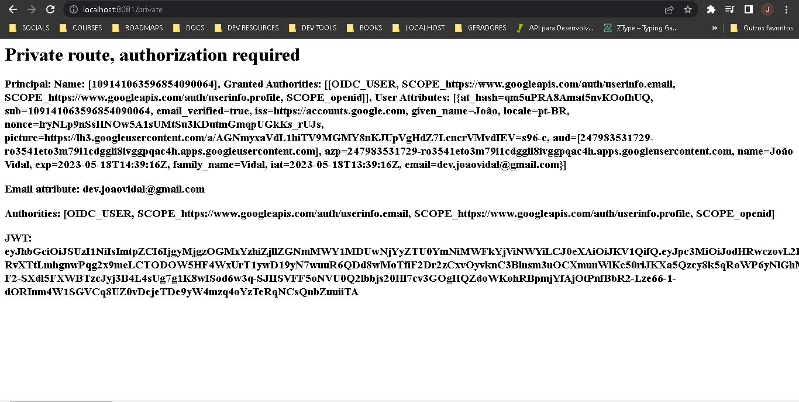

#### Cookie presente no navegador que autêntica a sessão:
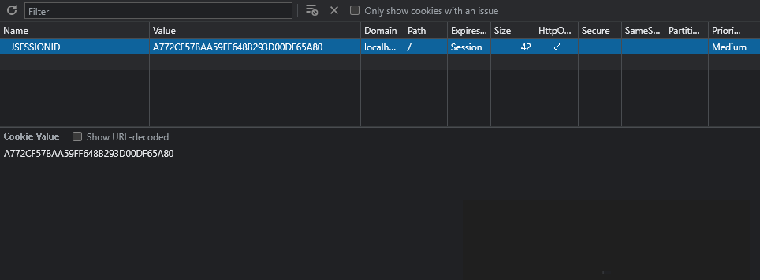

### Acessando a url via terminal com o cookie correto:
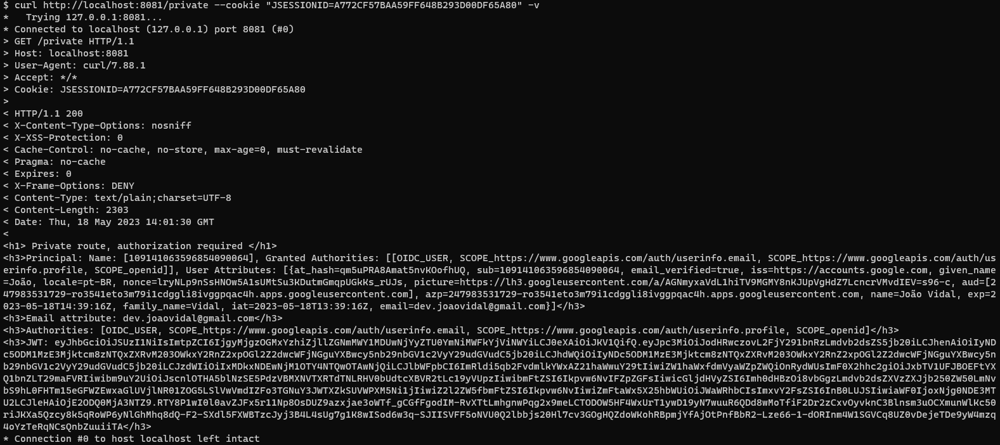

### Acessando a url com o cookie incorreto:
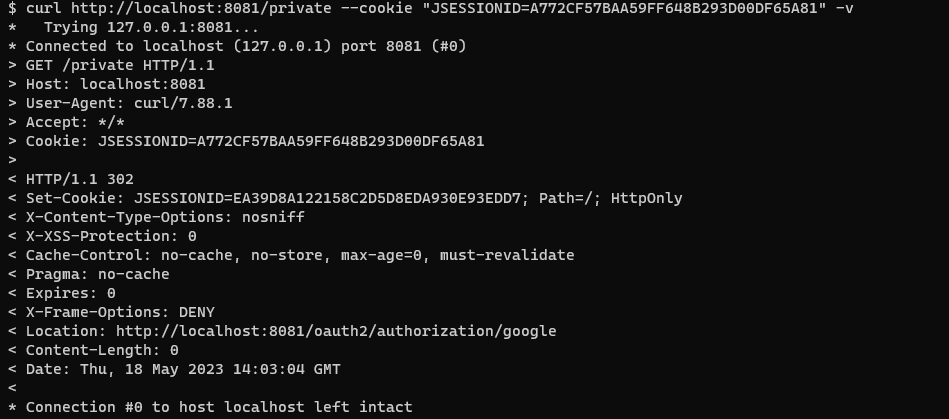
<br>
Perceba que a aplicação te redireciona para ser autênticado

- o comando -v detalha o header da requisição curl
Uma melhor práticar para autênticar rotas é utilizar o jwt ao invés dos cookies

## Utilizando JWT para autênticar as rotas ao invés de cookies
Após adicionar a dependencia OAuth2 resource server no nosso pom, definimos a seguinte configuração no application.properties:
````properties
spring.security.oauth2.resourceserver.jwt.issuer-uri=https://accounts.google.com
````
Agora basta adicionar no SecurityConfig o trecho de código
```.oauth2ResourceServer(OAuth2ResourceServerConfigurer::jwt)```

### Acessando a rota jwt com o token de autênticação
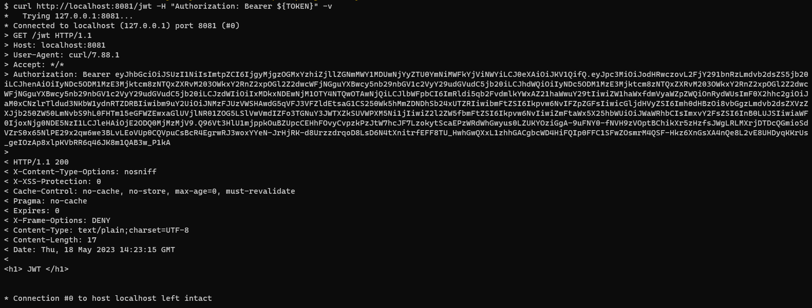
<br>

E finalmente, para manter o usuário logado com jwt e retornar seus dados, basta definir na controller:
````java
public class example {
    @GetMapping("/jwt")
    String jwt(@AuthenticationPrincipal Jwt jwt) {
        return String.format("""
                <h1> JWT </h1>
                Principal: %s\n
                Email attribute: %s\n
                JWT: %s\n
                                   
                """, jwt.getClaims(), jwt.getClaim("email"), jwt.getTokenValue());
    }
}
````


# OAuth 2.0 e OpenID
OAuth é um protocolo que habilita uma aplicação terceira a obter acesso limitado a um serviço HTTP
(Trabalha no escopo da autorização)

>Papéis do OAuth:
> 
>Resource Owner (dono do recurso) -> quem acessa a aplicação e busca pelo recurso
> 
>Resource Server (onde está o recurso) -> é quem recebe o token do client e autoriza a utilização do recurso
> 
>Authorization Server (concede acesso ao recurso) -> Serviço de IDP identity provider (Google, Facebook, etc..) é quem requisita as credenciais e ás valida, fornecendo um token de acesso. É importante ressaltar que o cliente não conhece as suas credênciais, ele vai utilizar o token de acesso para te autorizar
> 
>Client (solicita acesso ao recurso) -> aplicação que direciona a solicitação para o recurso


### Autenticação
Quem é você?
### Autorização
O que você tem permissão pra fazer?

## Tipos de Token

> ### Access token
> 
> Concede acesso a recursos protegidos
> 
> Compreendido pelo resource server
> 
> JWT ou OPACO
> 
> ### Refresh Token
> 
> Access tokens expiram
> 
> Obter novos tokens sem necessidade de logar novamente
> 
> Geralmente é opaco
> 
> Enviados para o authorization server


### Scopes
- Papéis, permissões associadas ao access token
ex: ler e-mails, criar eventos na agenda, acessar contatos, etc..

> ### Fluxo de autorização (Grant Types)
> Password, Client Credentials, Authorization Code, Implicit

## OpenID
É uma extensão do OAuth:
- OAuth2 autoriza o usuário a acessar um recurso
- OpenID me dá a identidade do usuário

> ### Access Token
> Oque você pode fazer
> ### Id Token
> Quem você é
> ### Endpoints
> /login, /token, /logout,/ userinfo -> endpoints padrão do openid

### Fluxos do OpenID
- Comum -> Apenas autentica usuário, retorna Id Token
- Hídrido (mais usado) -> Autentica e autoriza, retornando Id Token e Access Token

## Resumindo:
> ### OAuth2 é um protocolo de autorização
> #### Papéis
> - Resource Owner, Client, Authorization Server, Resource Server
> #### Tokens
> - Access tokens (JWT e Opaco)
> - Refresh Tokens
> #### Scopes
> #### Grant Types
> - Password, Client Credentials, Authorization Code, Implicit

> ### OpenID é um protocolo de autenticação
> - Extensão do OAuth2
> - Focado na identidade do usuário - Id Token
> - /login, /token, /userinfo, /logout

É possível fazer uma autênticação de ponta a ponta com as duas tecnologias aliadas.


